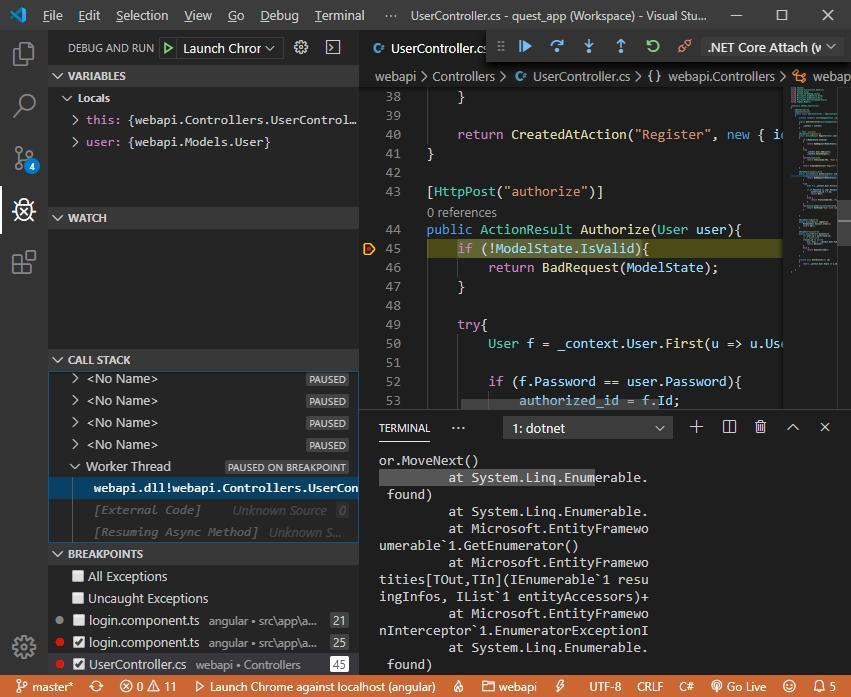
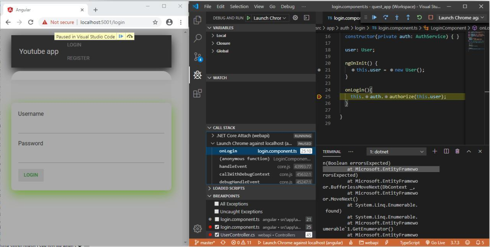

# quest

Debugging invironment is already set up.
Assuming that you have pre installed Google Chrome.
If so, all you need is just install VSCode extension by link:
https://marketplace.visualstudio.com/items?itemName=msjsdiag.debugger-for-chrome
Then you are able to launch angular in debug mode.

First of all launch your app like so:

```
dotnet watch [-v] run
```

Then you be able to continue. 
> *Uh, you`ve just done above half of job. =)*

#### How to debug dotnet app:

Choose proper config 


and proccess 


Working example:



#### How to debug angular app:

Choose proper config 


Working example:



> Usefull links:
>  Angular debugging tools:
>   https://automationpanda.com/2018/01/12/debugging-angular-apps-through-visual-studio-code/
>   
>   https://code.visualstudio.com/docs/nodejs/angular-tutorial#_debugging-angular
