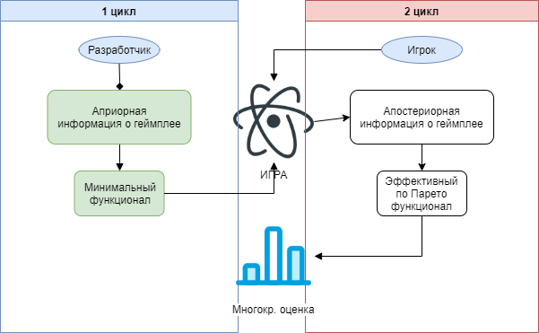

**Минимально жизнеспособный продукт (MVP)** — продукт, обладающий *минимальными*, но *достаточными* для удовлетворения первых потребителей функциями.
Сугубо говоря функционал делится на минимальный и эффективный по Парето. Если минимальный позволит устранить нехватку времени на разработку, то эффективный по Парето - устранит неопределенность выбора решений.

 Основная задача — получение обратной связи для формирования гипотез дальнейшего развития продукта.

На данный момент квест - один из основных **жанров** компьютерных игр, представляющий собой интерактивную историю с героем.